# belajar_widget

A new Flutter project.

## Getting Started

This project is a starting point for a Flutter application.

A few resources to get you started if this is your first Flutter project:

- [Lab: Write your first Flutter app](https://docs.flutter.dev/get-started/codelab)
- [Cookbook: Useful Flutter samples](https://docs.flutter.dev/cookbook)

For help getting started with Flutter development, view the
[online documentation](https://docs.flutter.dev/), which offers tutorials,
samples, guidance on mobile development, and a full API reference.

# PERTEMUAN 2 - BELAJAR WIDGET

Pada framework flutter terdapat banyak widget. Widget yang telah disediakan dapat 
digunakan mengembangkan aplikasi yang mobile, desktop dan web yang memiliki tampilan 
menarik. Secara lebih detail widget yang tersedia di flutter dapat dicek pada 
https://flutter.dev/docs/development/ui/widgets.

Berikut adalah beberapa contoh widget yang 
sering digunakan pada pembuatan aplikasi dengan flutter:

## Text Widget

Untuk menggunakan widget Text bisa menggunakan class Text 

```sh
Text('Ini Text')
```

Tampilan akan menjadi seperti ini:
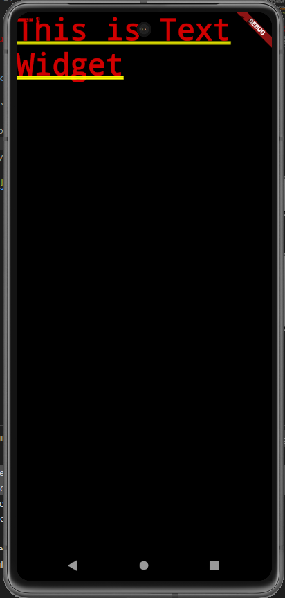

## Image Widget

Untuk menambahkan image bisa menggunakan widget Image

```sh
Image(
    image: NetworkImage('https://images.unsplash.com/photo-1693693234092-88b36b60eb77?ixlib=rb-4.0.3&ixid=M3wxMjA3fDB8MHxwaG90by1wYWdlfHx8fGVufDB8fHx8fA%3D%3D&auto=format&fit=crop&w=2070&q=80')
)
```

> Note: NetworkImage berfungsi untuk mengambil gambar dari internet.

Tampilan akan menjadi seperti ini:

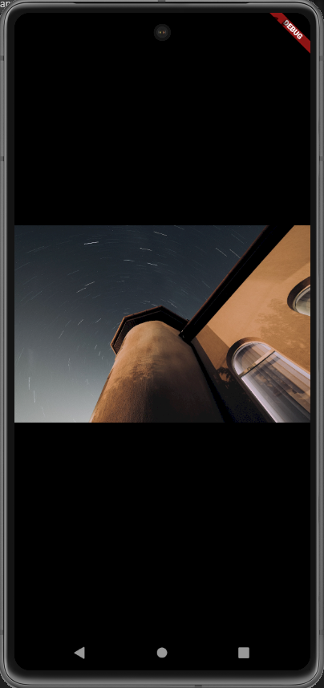

## Material Design dan iOS Cupertino

Cupertino widget digunakan untuk mendesain sesuai dengan standar desain pada iOS. 
Contoh penggunaan cupertino widget pada source code dan ouputnya adalah sebagai berikut:

1. pastikan sudah melakuakan import package cupertino

```sh
import 'package:flutter/cupertino.dart';
```

2. Source code Untuk menampilkan activity indicator

```sh
child: Column(
          children: <Widget>[
            AppBar(title: Text("Contoh Cupertino")),
            CupertinoButton(
              child: Text('Ini Contoh'),
              onPressed: () {},
            ),
            CupertinoActivityIndicator()
          ],
        )
```

3. Berikut adalah tampilan hasil source code tersebut

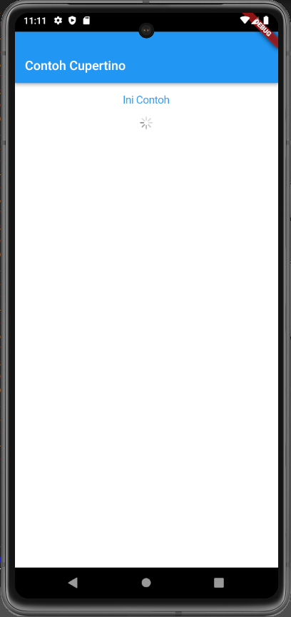


## Button Widget

Button widget terdapat beberapa macam pada flutter yaitu antara lain ButtonBar,  DropdownButton, FlatButton, FloatingActionButton, IconButton, OutlineButton, PopupMenuButton, dan RaisedButton.

Berikut adalah contoh button widget menggunakan FloatingActionButton

```sh
Widget build(BuildContext context) {
    return MaterialApp(
      home: Scaffold(
        floatingActionButton: FloatingActionButton(
          onPressed: () {
            //code
          },
          splashColor: Colors.blue,
          child: Icon(Icons.thumb_up_alt_rounded),
          backgroundColor: Colors.greenAccent,
          ),
      )
    );
  }
```

Tampilannya sebagai berikut:
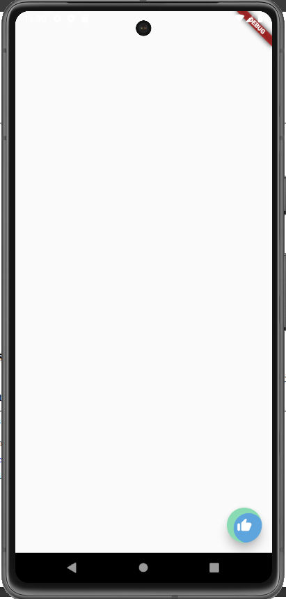

## Scaffold

Scaffold widget digunakan untuk mengatur tata letak sesuai dengan material design.

```sh
return MaterialApp(
 home: Scaffold(
    appBar: AppBar(
        title: Text('Sample Code'),
    ),
    body: Center(
        child: Text('You have pressed the button $_count times.'),
    ),
    bottomNavigationBar: BottomAppBar(
        child: Container(
            height: 50.0,
        ),
    ),
    floatingActionButton: FloatingActionButton(
        onPressed: () => 0,
            tooltip: 'Increment Counter',
            child: Icon(Icons.add),
    ),
    floatingActionButtonLocation: FloatingActionButtonLocation.centerDocked,
    ),
 );
```


Berikut adalah tampilan dari source code tersebut:

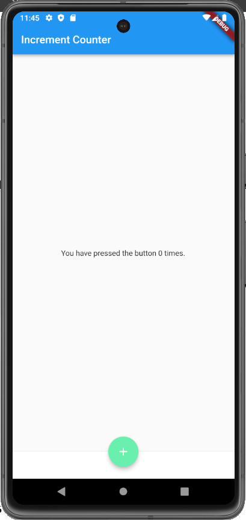


## Dialog Widget

Dialog widget pada flutter memiliki dua jenis dialog yaitu AlertDialog dan 
SimpleDialog.

Penggunaan Alert Dialog
1. Membuat button
```sh
home: Scaffold(
        appBar: AppBar(
          title: Text('Increment Counter'),
        ),
        body: Center(
          child: Text('You have pressed the button $_count times.')
        ),
        bottomNavigationBar: BottomAppBar(
          child: Container(
            height: 50.0,
          ),
        ),
        floatingActionButton: FloatingActionButton(
          onPressed: () {
            showAlertDialog(context);
          },
          tooltip: 'Increment Counter',
          splashColor: Colors.blue,
          child: Icon(Icons.add),
          backgroundColor: Colors.greenAccent,
        ),
        floatingActionButtonLocation: FloatingActionButtonLocation.centerDocked,
      )
```

2. Membuat widget alert Dialog
```sh
showAlertDialog(BuildContext context) {
  Widget okButton = TextButton(
    child: Text('OK'),
    onPressed: (){}
  );

  AlertDialog alert = AlertDialog(
    title: Text("Alert"),
    content: Text("Anda menekan button"),
    actions: [
      okButton,
    ],
  );

  showDialog(
    context: context,
    builder: (BuildContext context) {
      return alert;
    }
  );
}
```

Berikut adalah tampilan dari source code tersebut:


## Input dan Selection Widget

Flutter menyediakan widget yang dapat menerima input dari pengguna aplikasi yaitu antara lain Checkbox, Date and Time Pickers, Radio Button, Slider, Switch, TextField.

Berikut adalah source code penggunaan textField

```sh
body: Center(
          child: Column(
            children: [
              Container(
                margin: EdgeInsets.only(top: 20, bottom: 5, right: 10, left: 10),
                child: TextField(
                obscureText: false,
                decoration: InputDecoration(
                  border: OutlineInputBorder(),
                  labelText: 'Nama'
                ),
              ),
              ),
              Container(
                margin: EdgeInsets.only(top: 10, bottom: 5, right: 10, left: 10),
                child: TextField(
                obscureText: false,
                decoration: InputDecoration(
                  border: OutlineInputBorder(),
                  labelText: 'NIM'
                ),
              ),
              )
            ],
          )
        ),
```

Berikut adalah tampilannya

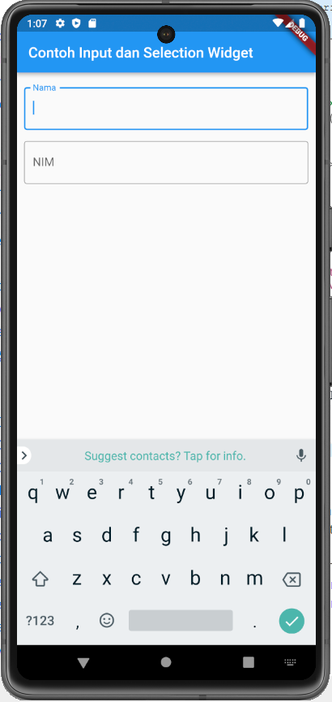


## Date and Time Pickers

Date and Time Pickers termasuk pada kategori input dan selection widget.

Berikut adalah penggunaan Date Picker
```sh
class _MyHomePageState extends State<MyHomePage> {

  DateTime selectedDate = DateTime.now();

  Future<Null> _selectDate(BuildContext context) async {
    final DateTime? picked = await showDatePicker(
      context: context, 
      initialDate: selectedDate, 
      firstDate: DateTime(2015, 9), 
      lastDate: DateTime(2100));
    if(picked != null && picked != selectedDate)
      setState(() {
        selectedDate = picked;
      });
  }

  @override
  Widget build(BuildContext context) {
    return MaterialApp(
      home: Scaffold(
        appBar: AppBar(
          title: Text('Date Picker'),
        ),
        body: Center(
          child: Column(
            mainAxisSize: MainAxisSize.min,
            children: <Widget> [
              Text("${selectedDate.toLocal()}".split('  ')[0]),
              SizedBox(height: 20.0,),
              TextButton(onPressed: () => {
                _selectDate(context),
                print(selectedDate.day + selectedDate.month + selectedDate.year)
              }, child: Text('Pilih Tanggal'))
            ],
          )
        ),
        
      )
    );
  }
}
```

Berikut adalah tampilannya

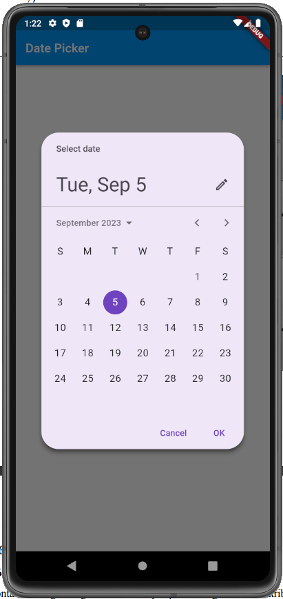


## Container

Container widget berguna untuk menyimpan berbagai macam attribute dan menampung 
berbagai macam fungsi objek. Container merupakan single child objek yang artinya hanya 
dapat memiliki satu buah child widget, akan tetapi dalam sebuat container kita dapat 
menempatkan row, column, text dan container lain. Container memiliki beberapa property 
yaitu:

1. Properti Child -> digunakan untuk membuat menampung widget didalam container. Widget yang ditampung antara lain Text, Column, ListView, Buton dan lain sebagainya

```sh
class MyApp extends StatelessWidget {
  const MyApp({super.key});

  // This widget is the root of your application.
  @override
  Widget build(BuildContext context) {
    return MaterialApp(
      home: Scaffold(
        appBar: AppBar(title: Text("Belajar Container")),
        body: Container(
          margin: EdgeInsets.all(20),
          child: TextButton(
            style: ButtonStyle(backgroundColor: MaterialStatePropertyAll<Color>(Colors.red)),
            onPressed: () {},
            child: Text(
              "Button",
              style: TextStyle(color: Colors.white, fontSize: 20),
            )),
        ),
      )
    );
  }
}
```

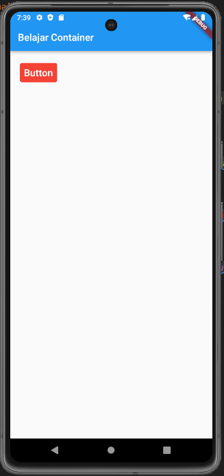

2. property alignment : mengatur posisi child widget menggunakan property Alignment.

```sh
class MyApp extends StatelessWidget {
  const MyApp({super.key});

  // This widget is the root of your application.
  @override
  Widget build(BuildContext context) {
    return MaterialApp(
      home: Scaffold(
        appBar: AppBar(title: Text("Belajar Container")),
        body: Container(
          alignment: Alignment.bottomCenter,
          margin: EdgeInsets.all(20),
          child: TextButton(
            style: ButtonStyle(backgroundColor: MaterialStatePropertyAll<Color>(Colors.red)),
            onPressed: () {},
            child: Text(
              "Button",
              style: TextStyle(color: Colors.white, fontSize: 20),
            )),
        ),
      )
    );
  }
}
```


3. property color : digunakan untuk mengubah wara latar belakang container. Untuk memilih warna dapat menghover warna maka akan muncul pilihan warna yang dapat kita gunakan

4. Property height dan width : Secara default ukuran container menyesuaikan dengan ukuran body layar, maka untuk mengatur layoutnya dapat menggunakan property height dan width.

5. property margin : membuat jarak container dengan dengan widget lainnya

```sh
class MyApp extends StatelessWidget {
  const MyApp({super.key});

  // This widget is the root of your application.
  @override
  Widget build(BuildContext context) {
    return MaterialApp(
      home: Scaffold(
        appBar: AppBar(title: Text("Belajar Container")),
        body: Column(
          children: [
            Container(
              padding: EdgeInsets.only(top: 20),
              margin: EdgeInsets.all(50),
              height: 200,
              width: 200,
              alignment: Alignment.topCenter,
              color: Colors.blueGrey,
              child: Text(
                "Belajar Flutter",
                style: TextStyle(
                  fontSize: 20,
                  color: Colors.white
                ),
              ),
            ),
            Container(
              alignment: Alignment.bottomCenter,
              child: TextButton(
                style: ButtonStyle(backgroundColor: MaterialStatePropertyAll<Color>(Colors.red)),
                onPressed: () {},
                child: Text(
                  "Button",
                  style: TextStyle(color: Colors.white, fontSize: 20),
                )),
            ),
          ],
        ),
      )
    );
  }
}

```

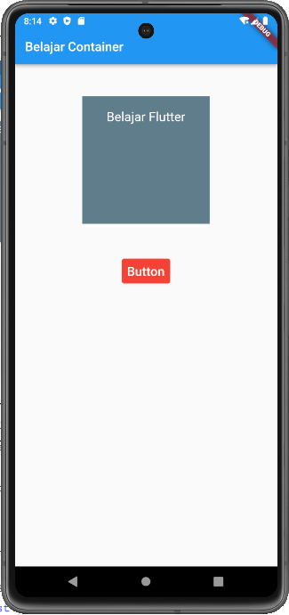

6. property transform : berfungsi untuk melakukan rotasi pada container dengan melakukan dari berbagai sumbu putar misalnya X,Y, dan Z

7. property decoration : untuk mencustom container dengan berbagai macam efek misalnya dengan mengubah warna border, memberikan gambar, dan membuat efek bayangan.

```sh
class MyApp extends StatelessWidget {
  const MyApp({super.key});

  // This widget is the root of your application.
  @override
  Widget build(BuildContext context) {
    return MaterialApp(
      home: Scaffold(
        appBar: AppBar(title: Text("Belajar Container")),
        body: Column(
          children: [
            Container(
              height: 200,
              width: 300,
              margin: EdgeInsets.only(left: 30, right: 30, top: 50),
              transform: Matrix4.rotationZ(-0.1),
              decoration: BoxDecoration(
                border: Border.all(color: Colors.blue, width: 10),
                borderRadius: BorderRadius.circular(10)
              ),
              child: Image(
                image: NetworkImage('https://images.unsplash.com/photo-1682685797303-0ad51eb23e13?ixlib=rb-4.0.3&ixid=M3wxMjA3fDF8MHxwaG90by1wYWdlfHx8fGVufDB8fHx8fA%3D%3D&auto=format&fit=crop&w=2070&q=80'),
                fit: BoxFit.fitWidth,),
            ),
          ],
        ),
      )
    );
  }
}
```

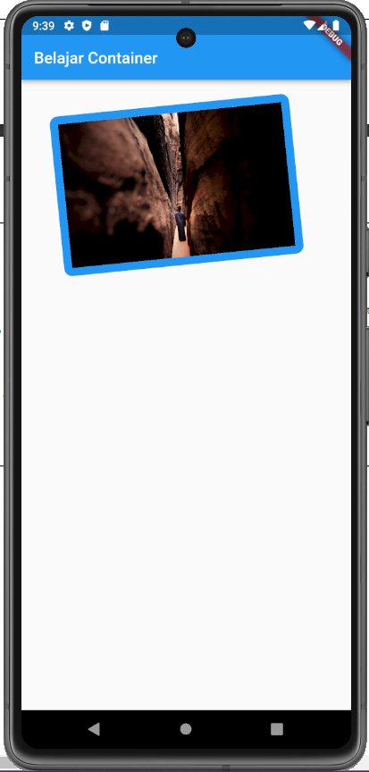

## Row dan Column

Column widget digunakan untuk mangatur tata letak widget secara vertikal. Sedangkan row digunakan untuk mengatur tata letak widget secara horizontal. Berikut adalah gambaran perbedaan row dan widget adalah sebagai berikut:

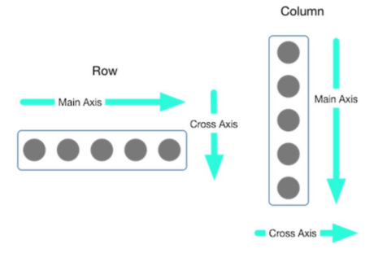

```sh
class MyApp extends StatelessWidget {
  const MyApp({super.key});

  // This widget is the root of your application.
  @override
  Widget build(BuildContext context) {
    return MaterialApp(
      home: Scaffold(
        appBar: AppBar(title: Text("Belajar Container")),
        body: Column(
          children: [
            Container(
              margin: EdgeInsets.all(30),
              child: Column(
                children: [
                  Container(
                    margin: EdgeInsets.only(bottom: 10),
                    child: Row(
                      children: [
                        Container(
                          margin: EdgeInsets.only(right: 30),
                          color: Colors.blueAccent,
                          child: FlutterLogo(size: 80,),
                        ),
                        Container(
                          margin: EdgeInsets.only(right: 30),
                          color: Colors.redAccent,
                          child: FlutterLogo(size: 80,),
                        ),
                        Container(
                          margin: EdgeInsets.only(right: 30),
                          color: Colors.greenAccent,
                          child: FlutterLogo(size: 80,),
                        ),
                      ],
                    ),
                  ),
                  Container(
                    margin: EdgeInsets.only(bottom: 10),
                    color: Colors.yellowAccent,
                    child: FlutterLogo(size: 80,),
                  ),Container(
                    margin: EdgeInsets.only(bottom: 10),
                    color: Colors.orangeAccent,
                    child: FlutterLogo(size: 80,),
                  )
                ],
              ),
            ),
          ],
        ),
      )
    );
  }
}
```

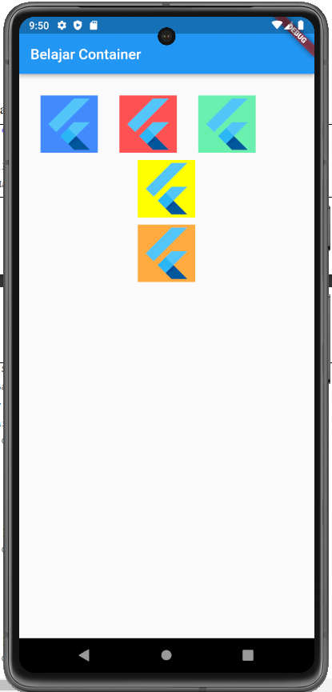


## Stack

Stack Widget digunakan untuk menumpuk beberapa widget pada beberapa lapisan

```sh
class MyApp extends StatelessWidget {
  const MyApp({super.key});

  // This widget is the root of your application.
  @override
  Widget build(BuildContext context) {
    return MaterialApp(
      home: Scaffold(
        appBar: AppBar(title: Text("Belajar Container")),
        body: Stack(
          alignment: Alignment.topCenter,
          children: <Widget>[
            Container(
              color: Colors.greenAccent,
              alignment: Alignment.bottomCenter,
              child: Text("Satu", 
              style: TextStyle(
                fontSize: 30,
                color: Colors.white),),
            ),
            Container(
              width: 300,
              height: 400,
              color: Colors.blueAccent,
              alignment: Alignment.bottomCenter,
              child: Text("Dua", 
              style: TextStyle(
                fontSize: 30,
                color: Colors.white),),
            ),
            Container(
              width: 200,
              height: 200,
              color: Colors.redAccent,
              alignment: Alignment.bottomCenter,
              child: Text("Tiga", 
              style: TextStyle(
                fontSize: 30,
                color: Colors.white),),
            )
          ],
        )
      )
    );
  }
}
```


