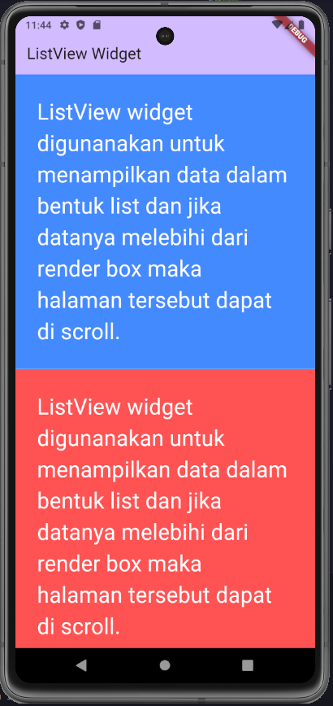
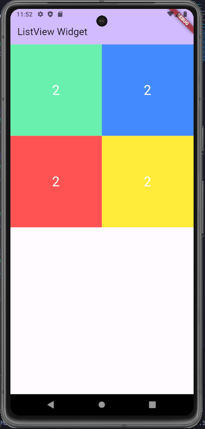

# belajar_layout

A new Flutter project.

## Getting Started

This project is a starting point for a Flutter application.

A few resources to get you started if this is your first Flutter project:

- [Lab: Write your first Flutter app](https://docs.flutter.dev/get-started/codelab)
- [Cookbook: Useful Flutter samples](https://docs.flutter.dev/cookbook)

For help getting started with Flutter development, view the
[online documentation](https://docs.flutter.dev/), which offers tutorials,
samples, guidance on mobile development, and a full API reference.

# PERTEMUAN 3 - BELAJAR LAYOUT

Pada framework flutter terdapat banyak widget. Widget yang telah disediakan dapat 
digunakan mengembangkan aplikasi yang mobile, desktop dan web yang memiliki tampilan 
menarik. Secara lebih detail widget yang tersedia di flutter dapat dicek pada 
https://flutter.dev/docs/development/ui/widgets.

Berikut adalah beberapa contoh widget yang 
sering digunakan pada pembuatan aplikasi dengan flutter:

## List View

ListView widget digunanakan untuk menampilkan data dalam bentuk list dan jika datanya melebihi dari render box maka halaman tersebut dapat di scroll.

```sh
class _MyHomePageState extends State<MyHomePage> {

  @override
  Widget build(BuildContext context) {
    return Scaffold(
      appBar: AppBar(
        backgroundColor: Theme.of(context).colorScheme.inversePrimary,
        title: Text(widget.title),
      ),
      body: ListView(
        children: <Widget>[
          Container(
            padding: EdgeInsets.all(30),
            color: Colors.blueAccent,
            alignment: Alignment.topLeft,
            child: Text(
              "ListView widget digunanakan untuk menampilkan data dalam bentuk list dan jika datanya melebihi dari render box maka halaman tersebut dapat di scroll.",
              style: TextStyle(
                fontSize: 30,
                color: Colors.white
              ),
            ),
          ),
          Container(
            padding: EdgeInsets.all(30),
            color: Colors.redAccent,
            alignment: Alignment.topLeft,
            height: 400,
            width: 300,
            child: Text(
              "ListView widget digunanakan untuk menampilkan data dalam bentuk list dan jika datanya melebihi dari render box maka halaman tersebut dapat di scroll.",
              style: TextStyle(
                fontSize: 30,
                color: Colors.white
              ),
            ),
          ),
          Container(
            padding: EdgeInsets.all(30),
            color: Colors.purpleAccent,
            alignment: Alignment.topLeft,
            height: 200,
            width: 200,
            child: Text(
              "ListView widget digunanakan untuk menampilkan data dalam bentuk list dan jika datanya melebihi dari render box maka halaman tersebut dapat di scroll.",
              style: TextStyle(
                fontSize: 30,
                color: Colors.white
              ),
            ),
          )
        ],
      )// This trailing comma makes auto-formatting nicer for build methods.
    );
  }
}
```

Tampilan akan menjadi seperti ini:



## GridView

Gridview digunakan untuk menata tata letak widget pada list 2 dimensi. GridView juga
secara otomatis menyediakan scrolling ketika konten melebihi render box.

```sh
Widget build(BuildContext context) {
    return Scaffold(
      appBar: AppBar(
        backgroundColor: Theme.of(context).colorScheme.inversePrimary,
        title: Text(widget.title),
      ),
      body: GridView.count(
        crossAxisCount: 2,
        children: <Widget>[
          Container(
            color: Colors.greenAccent,
            alignment: Alignment.center,
            child: Text("2", style: TextStyle(fontSize: 30, color: Colors.white),),
          ),
          Container(
            color: Colors.blueAccent,
            alignment: Alignment.center,
            child: Text("2", style: TextStyle(fontSize: 30, color: Colors.white),),
          ),
          Container(
            color: Colors.redAccent,
            alignment: Alignment.center,
            child: Text("2", style: TextStyle(fontSize: 30, color: Colors.white),),
          ),
          Container(
            color: Colors.yellow,
            alignment: Alignment.center,
            child: Text("2", style: TextStyle(fontSize: 30, color: Colors.white),),
          )
        ],
      )// This trailing comma makes auto-formatting nicer for build methods.
    );
  }
```

Tampilan akan menjadi seperti ini:


