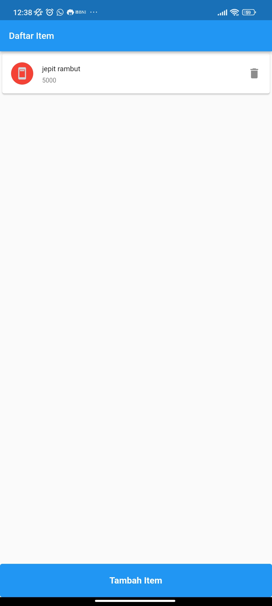
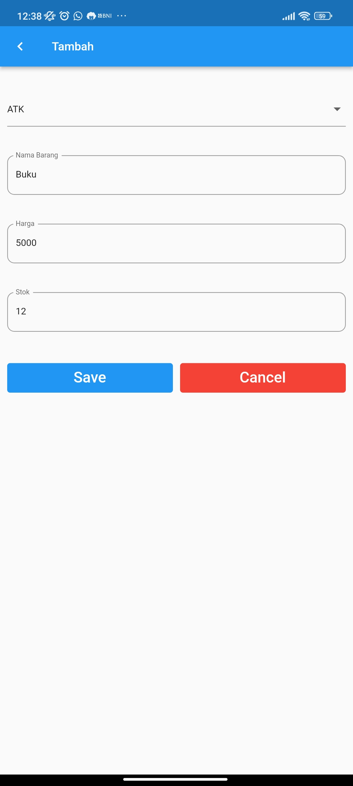
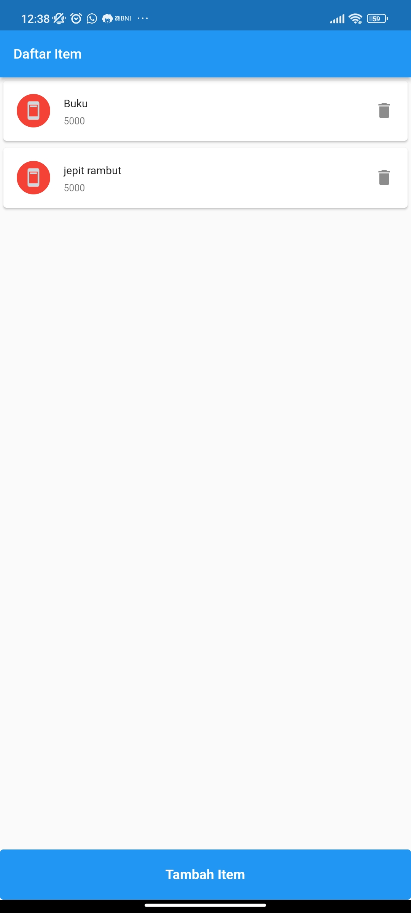

# sqlite_flutter

Project ini adalah project CRUD data stok barang yang terintegrasi dengan SQFLITE flutter.

## Preview
Halaman Home, Menampilkan list barang apa saja yang tersedia dan harganya

Halaman EntryForm, halaman form untuk menambahkan atau mengedit data

Halaman Home setelah add data

## Getting Started

This project is a starting point for a Flutter application.

A few resources to get you started if this is your first Flutter project:

- [Lab: Write your first Flutter app](https://docs.flutter.dev/get-started/codelab)
- [Cookbook: Useful Flutter samples](https://docs.flutter.dev/cookbook)

For help getting started with Flutter development, view the
[online documentation](https://docs.flutter.dev/), which offers tutorials,
samples, guidance on mobile development, and a full API reference.
